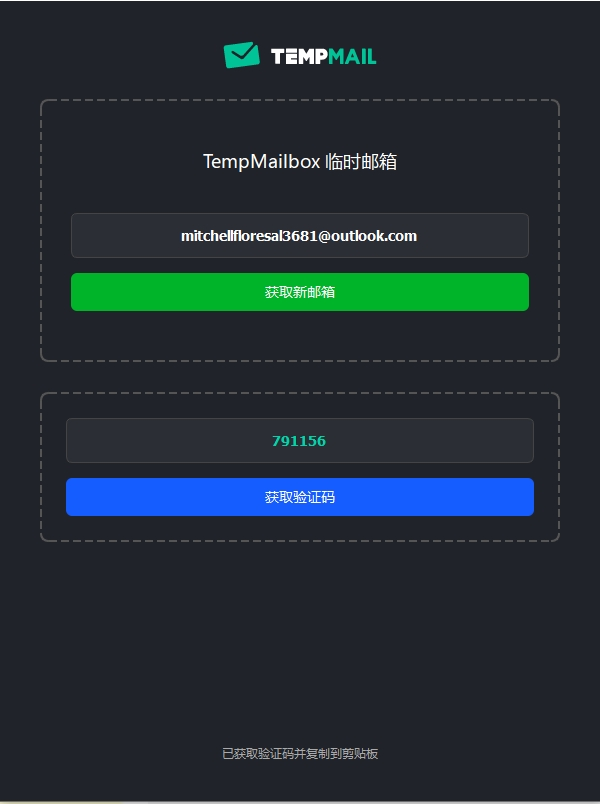

# TempMailbox 临时邮箱工具

TempMailbox 是一个用于注册cursor免费账号临时邮箱工具，提供简单易用的临时邮箱服务，帮助用户快速在cursor注册账号，实现免费续杯，不用再去自建域名邮箱和使用其他免费邮箱，解决没有大量邮箱号的问题。

## 截图展示

## 下载使用

### 直接下载可执行文件

在 [Releases](https://github.com/FFMSR/TempMailbox/releases) 页面下载最新版本的 `TempMailbox.exe`即可运行

## 使用说明

1. 首次运行时，需要通过扫描二维码关注公众号获取验证码
2. 验证成功后，系统会自动分配一个临时邮箱地址
3. 点击"获取新邮箱"可以更换新的邮箱地址
4. 收到邮件后，点击"获取验证码"可以自动提取邮件中的验证码
